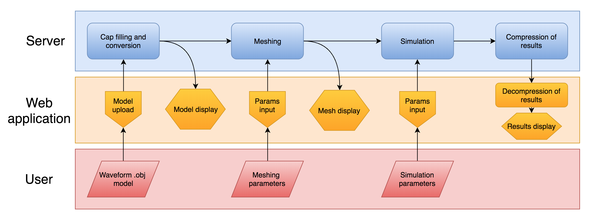

# simvis-masters
Web-based simulation and visualization of cardiovascular blood flow - Master's thesis project, 2017, Faculty of Computer and Information Science, University of Ljubljana

The project is composed of two main:
1.     Web application, tasked with rendering the UI and providing controls for 3D interaction with the simulation results, as well as decompressing the results
2.     Server-side node.js application, making use of the following:
        - Python scripts for parsing, compressing and converting simulation data and input models
        - SimVascular scripts for creating an automatic workflow of meshing the input model, running the simulation and collecting the simulation results
    
Server-side requirements: SimVascular version 2.0.20404, TCL, Node.JS
    
Application workflow:

The full thesis is available at http://eprints.fri.uni-lj.si/3986/

Direct address: http://eprints.fri.uni-lj.si/3986/1/Oblak.pdf
